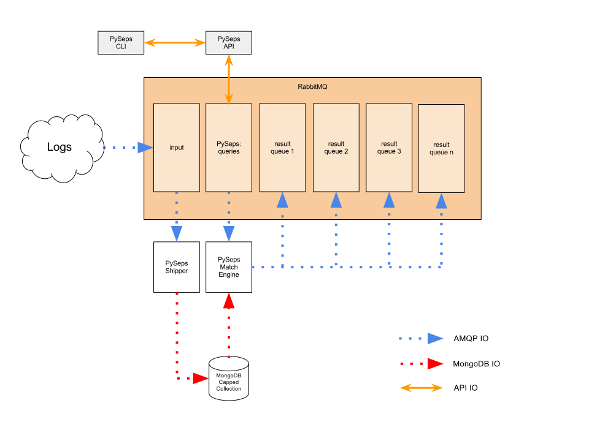

PySeps
======

Disclaimer: PySeps is currently a proof of concept and incomplete.

What?
-----
A Python based Simple Event Processing Server framework. Consume a stream of
documents and forward matching documents to another destination using
different types of query engines.

How?
----
PySeps is build on the WishBone framework which allows you to build coroutine
based event pipelines.  PySeps delivers a set of modules which can be plugged into
the WishBone framework.  Each module acts as a different engine to perform the
document matching.

Engines:
--------

MapMatch:
~~~~~~~~~
https://github.com/smetj/pyseps/tree/master/pyseps/mapmatch

The MapMatch engine converts a sequence of evaluation rules into a map to
match the most requested evaluations first in an attempt to have a statistical
advantage over dumb sequential evaluation of all rules until a match is found.
If a match occurs the document is forwarded to the WishBone queue associated
with the matching rule.

TailingCursor:
~~~~~~~~~~~~~~
https://github.com/smetj/pyseps/tree/master/pyseps/tailingcursor

By creating a tailing cursor containing a MongoDB query and by applying that
cursor to a capped collection which constantly receives new documents,  we
have a quite powerful filtering mechanism to extract from a constant stream
the documents we want.

Setup
-----

Pypi
~~~~

	$ easy_install pyseps

GitHub
~~~~~~

	$ git clone https://github.com/smetj/pyseps.git

	$ cd pyseps

	$ python setup.py install